# Inspiration
Greater than 90% of U.S. adults daily consume sodium in excess of the 1500 milligrams recommended by the guidelines of the Institute of Medicine (IOM) and multiple other medical associations. This is true despite innumerable scientific and public health documents over decades recommending a restricted dietary sodium intake. The recommendation to limit sodium intake have been made most strongly for populations with established cardiovascular disease including; hypertension, cerebrovascular disease, congestive heart failure, aortic aneurysm and chronic kidney disease.

# Overview
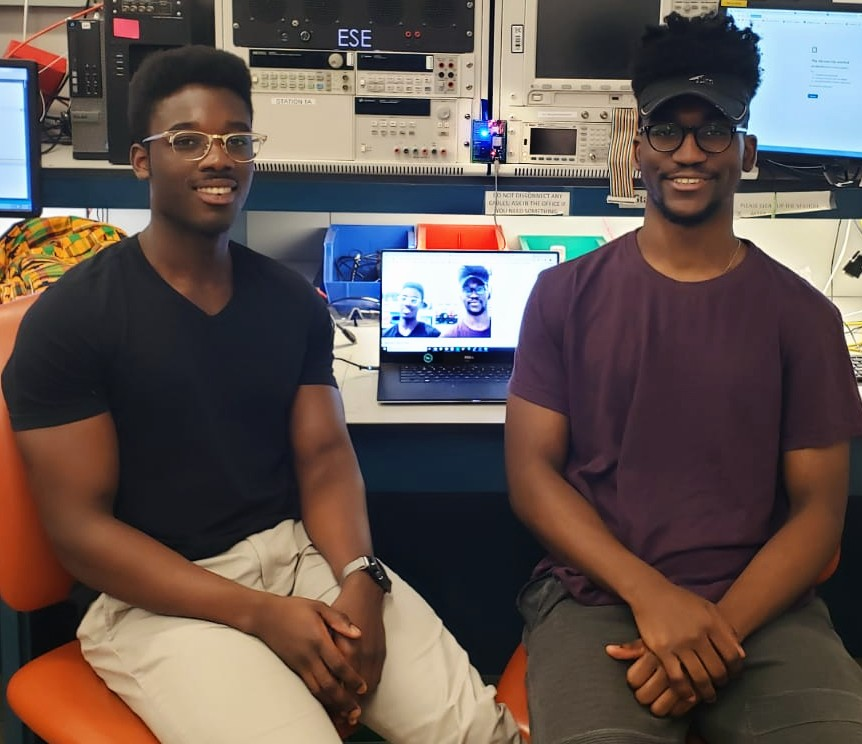

The Calorie LifeCam captures images continuously every 30 seconds and compares the images using IBM Watson's visual recognition tool to categorize food images. It can also distinguish between food and non-food. It then pushes the images to a Google Cloud storage bucket. We setup the Google Cloud IoT core as a way to store images on the cloud and we are also able to push telemetry data to the cloud. The user can view these images via a local MQTT server that we created and view the images on a continuous loop. Our LifeCam is also adept at power management. It utilizes a Razor IMU unit to determine the orientation of the camera and if the camera has been lying flat for a sufficient amount of time (2 min) we enter Deep Sleep mode which activates the ESP32's Ultra Low Power (ULP) coprocessor mode which deactivates every internal system except for the RTC (real time clock) which requires only a 6 uA draw to maintain functionality. We come out of ULP mode to sample the IMU every 30 seconds to determine whether the orientation has changed (so that we can permanently exit deep sleep mode). We sample the IMU using UART communication protocol.

# Blog
## Week 1 (4/8/19)
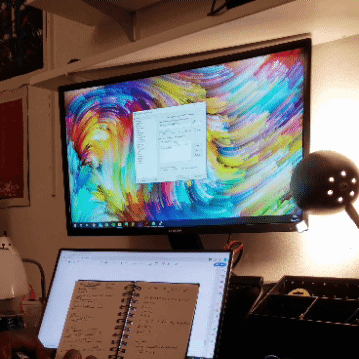

A large amount of our time was dominated by learning to use and configure our ESP32.

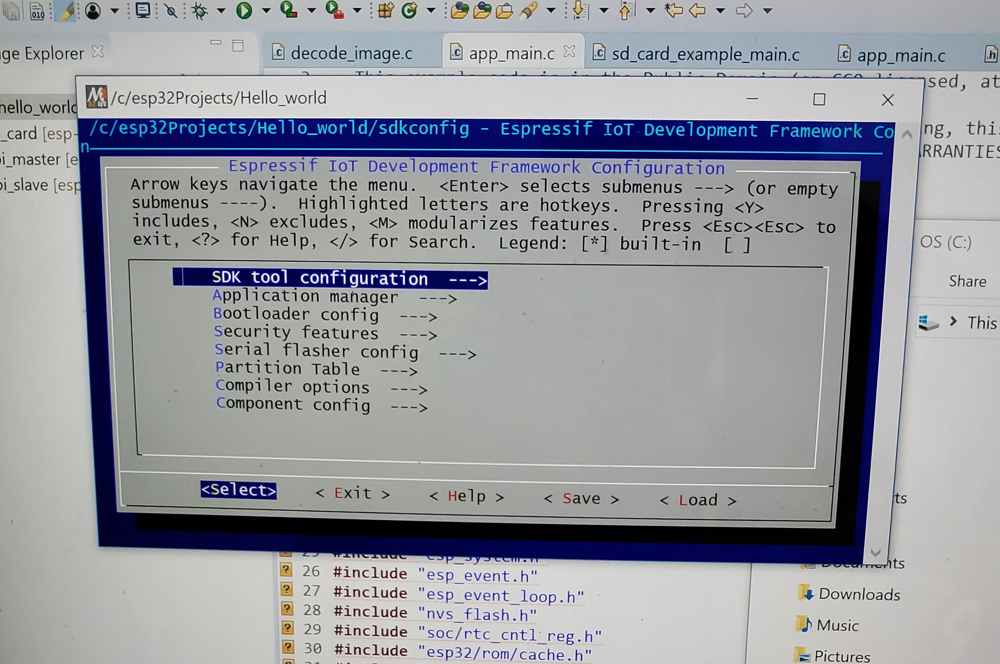

We found ourselves embroiled in setting up low-level espressif software, OS environment variables, resourse paths and more in an effort to be able to build and flash our C/C++ code which was dependent on the [esp-idf libraries](https://github.com/espressif/esp-idf). After much effort & error, we managed to configure our laptops to interface with the ESP32 and run a simple "Hello World" script.

Up until this point we had been using an ArduCam which had all its support and libraries based on the arduino library. We spent a lot of time rewriting the Arduino libraries into our own libraries in pure C/C++ and while we feel we were close to acheiving this, the endeavour proved to take up too much time. Instead of reinventing the wheel, we decided to shift focus for week 2.

### Circuit End of Week 1
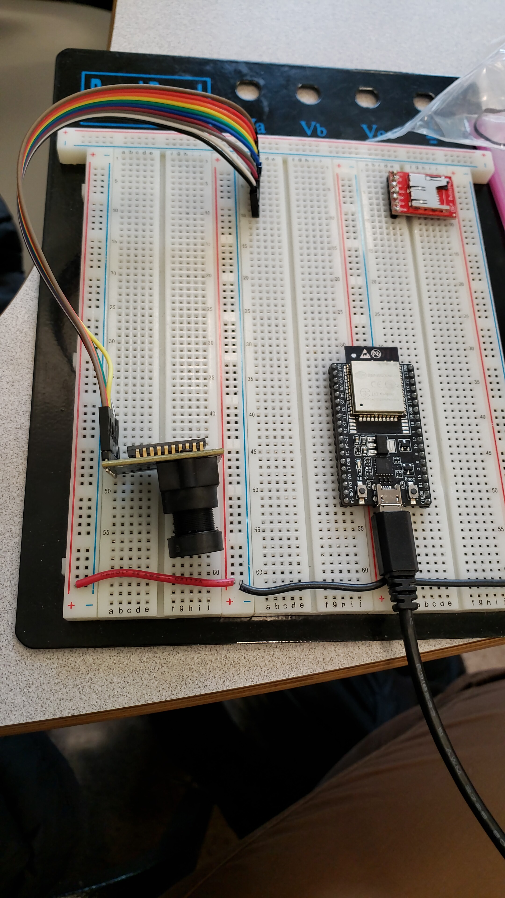

## Week 2 (4/15/19)

Taking a break from the camera, we  went on to learn how to use the UART Rx/Tx pins to interface a Razor IMU with the ESP32. After mapping our device pinout (as there seem to be a couple of ESP32 models out there with different pinouts) we were able to read orientation data straight from our IMU which will help us implement our 'deep sleep' mode based on device orientation.

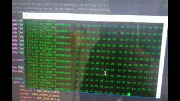

We switched cameras from ArduCam to a much more adaptable OV7670 w/out FIFO and finally managed to process our image! This camera only has minimal dependencies on the Arduino library as opposed to the ArduCam. We are still awaiting the shipment of an ESP32 dedicated camera.

### Circuit End of Week 2
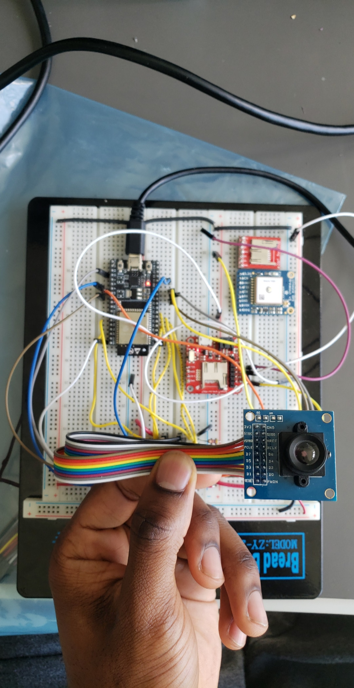

We setup a hotspot on a phone (as a user would) and connected our system to the network. We relayed the image to  a locally hosted webserver for now. We hope to pull the image for processing using dedicated machine learning libraries to determine whether the patient has captured an image of food or not.

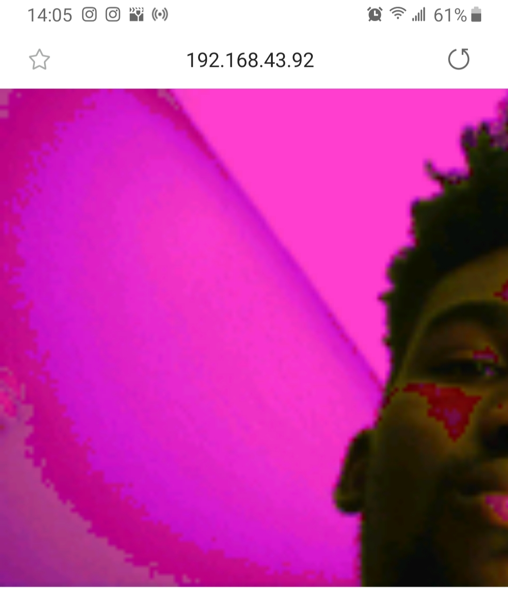

While we were able to successfully capture images using DMA, the images came out discoloured unless intense light was shone on the subject. We postulate this could be happening for a few reasons which we've narrowed down to the following:

- **Lack of FIFO:** from what we've read online, using the OV7670 without FIFO does not produce the best picture quality
- **Long Wires:** We have a very long path of wires until they finally reach their destination. They all could be acting as antennas. Shortening these connections might increase image quality.
- **Current Imbalance:** We might be using an illadvised pull-up resistor combination that is incorrectly balancing the output.
- **Damaged Module:** This camera has been circulating Detkin for quite some time.

In any case, we have ordered an ESP32 dedicated camera that hopefully we will be able to integrate soon.

## Week 3 (4/22/19)

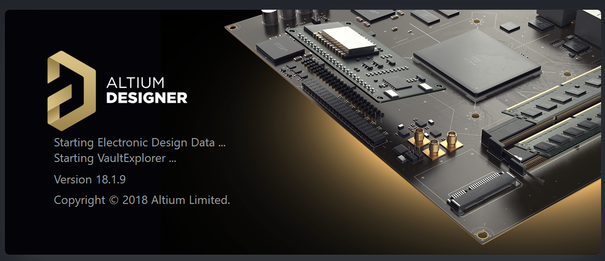

Although we had been behind schedule we managed to design a multilayer PCB in Altium. 

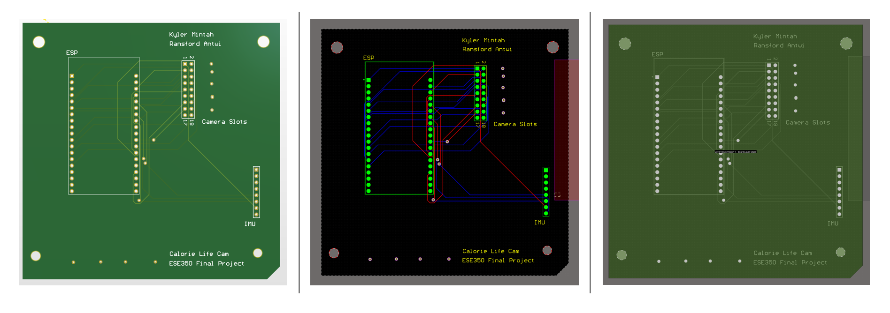

We did not have much time to review it as we were already behind schedule due to days of troubleshooting and writing our abandoned custom libraries to enable camera functionality. 
Had we had more time, we would have added a VCC and GND layer with vias leading to each to simplify our routing. We also would have liked to implement a more stringent design rule check. We felt our routes may have been too close together and too thin.

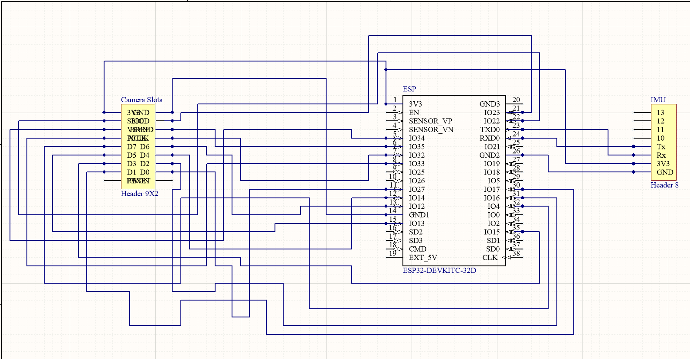

**IMU Update**

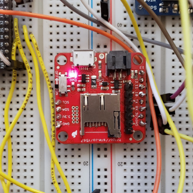

We have now pivoted back to the IMU subsytem and are focussed on integrating it with the camera functionality. 

Unfortunately the integration was not a simple task. We eventually ran into problems with the ESP32 scheduler and the task watchdog timer. 
The default clock tick rate is 100Hz which is configurable but generally 100 Hz provides a good balance between ISR overhead and responsiveness.

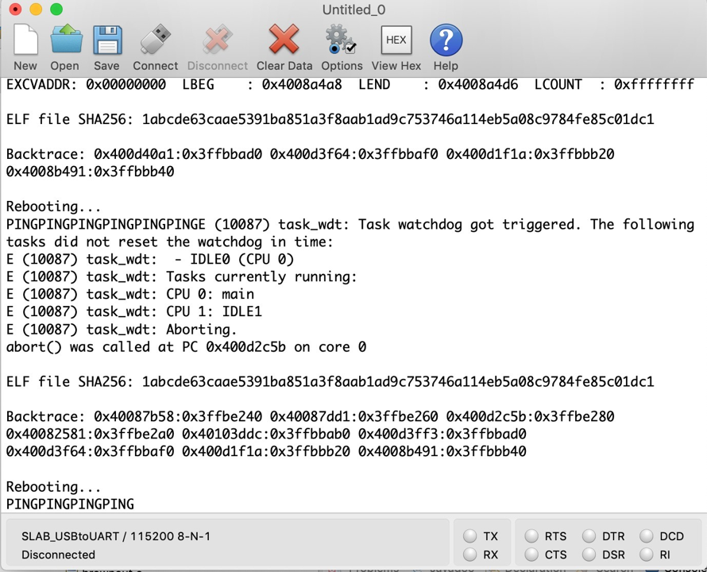

The implication of this was that portTICK_PERIOD_MS was 10ms per tick. Hence a 2ms vTaskDelay corresponds a 0 tick delay, which means no delay at all, which is interpreted as "yield to higher priority tasks, otherwise keep running". Thus our io_task may be starving our lower priority tasks, such as the Idle task, if it never blocks waiting for something else to happen.

We read that to solve this we can try disabling the watchdog timer but we became weary of this as this would starve lower priority tasks like the idle task which is actually utilized for cleanup of deleted tasks. The FreeRTOS timer task also runs at low priority and hence may be perpetually blocked.

We are still currently exporing a fix to this.

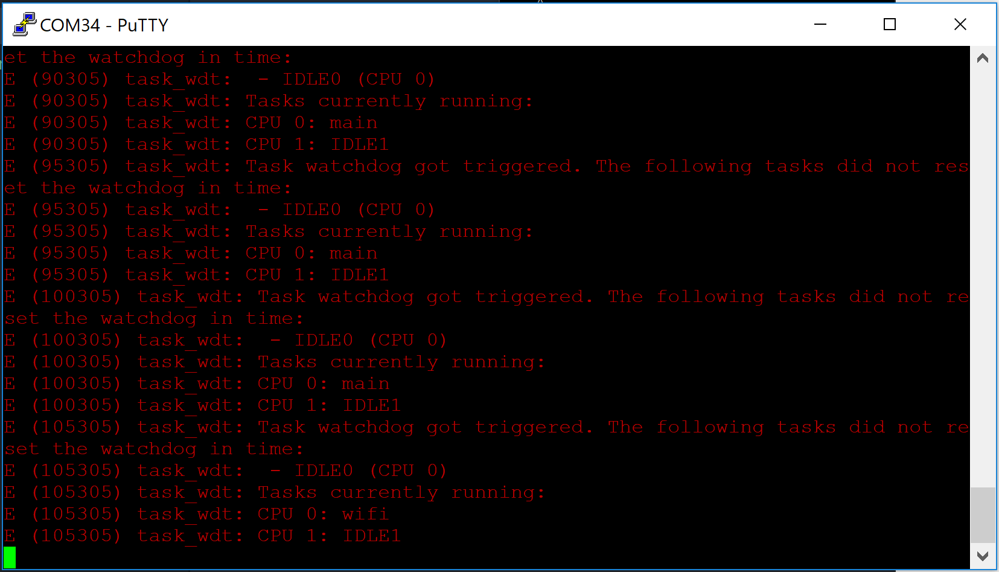

## Week 4 (4/27/19)
We fixed our task scheduling errors by multithreading the system and running the camera and IMU task in parallel. This helped prevent the starvation of certain tasks. The PCB was completed in time for the baseline demo, however we were not able to generate any images from the camera, not even the discolored ones we produced earlier which was quite a shock. We were able to integrate our project with Google Cloud Services via an MQTT bridge in order to send telemetry data as well as possibly store images on the cloud. We opted not to store the images on the cloud yet due to the fact that we would have to pay for cloud storage but it's certainly possible since we are already able to send telemetry data.

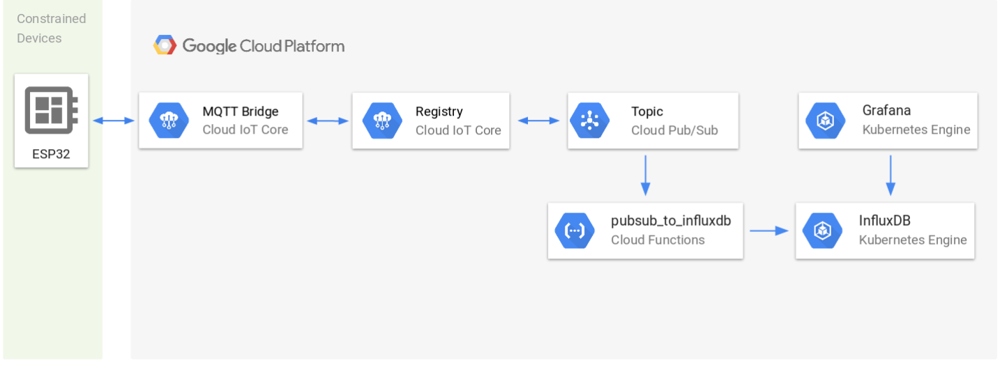

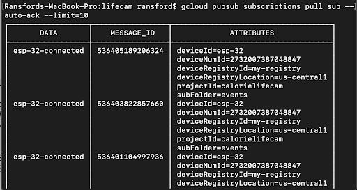

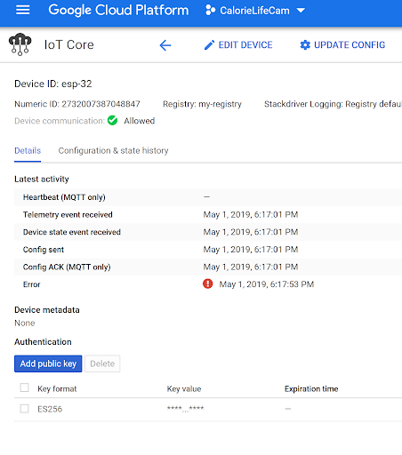

## Public demo + Results(5/9/19)
We decided to change our camera module because we were still unsure as to why we were unable to generate any images. We also re-built the project on a protoboard due to potentially faulty connections on the PCB and we reassigned some of the camera pins on the ESP-32. These changes proved to be the difference maker and we were able to finally generate decent images.

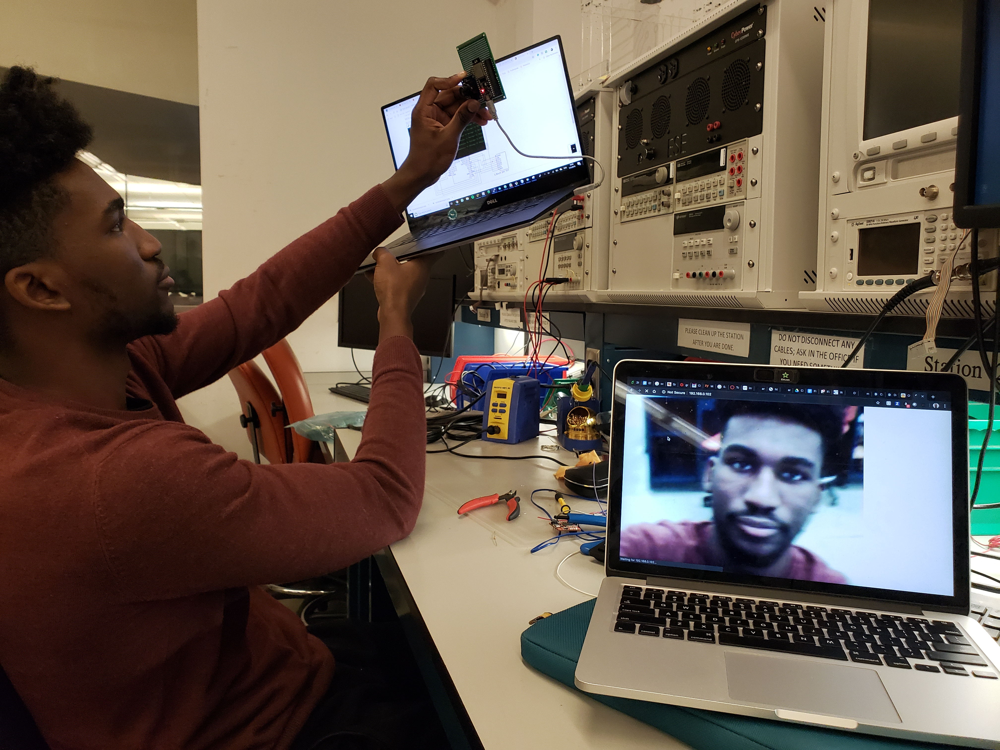

We proceeded to tie up all the loose ends in time for the demo. This involved finally completing the deep sleep mode and triggering the ultra low processor (ULP) mode when the camera was laying flat for a certain period of time. In order to make this a truly wireless device, We added an RGB indicator to let us know what was happening, e.g. when it's connecting to wifi the camera flashes blue, when it's in ULP mode it flashes green, and it also flashes when it's taking an image. We also embedded 3 AA batteries within the casing of the device and used that as a power source.

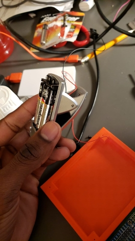     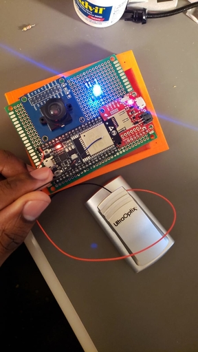

We were also able to curl Watson's food recognition platform and use the images form our camera to recognise and distinguish between different foods!

**Results**
The image below was taken during the demo. We took a picture of pizza and Watson was able to categorize it as pizza with 78.8% accuracy.
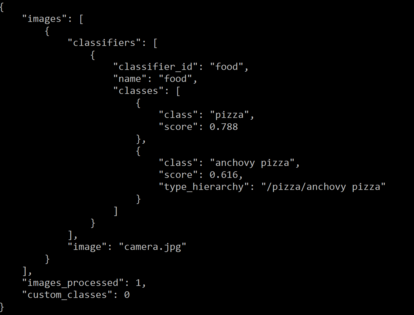

The next image is a bowl of almonds and Watson was able to categorize it as an edible nut. not specifically almonds but it's still a great result.

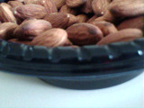   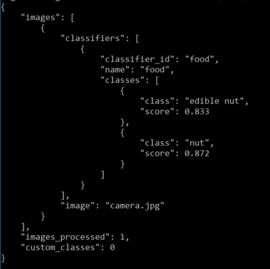

What happens when you take a picture of a non-food image? Watson tells us it's "non-food" which is perfect for out purposes.

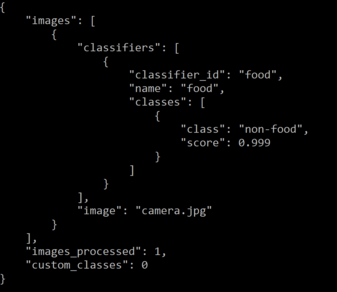 

**Final Prototype**

    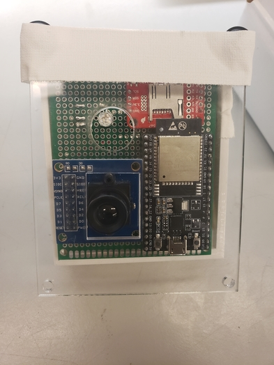 
