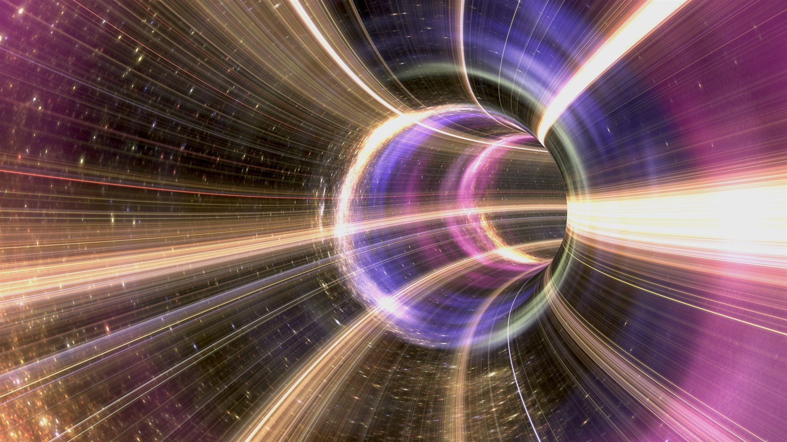
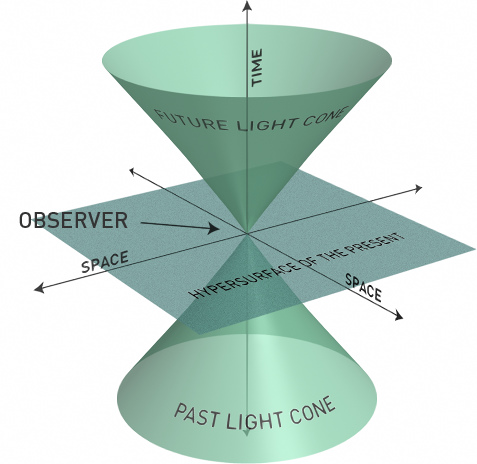
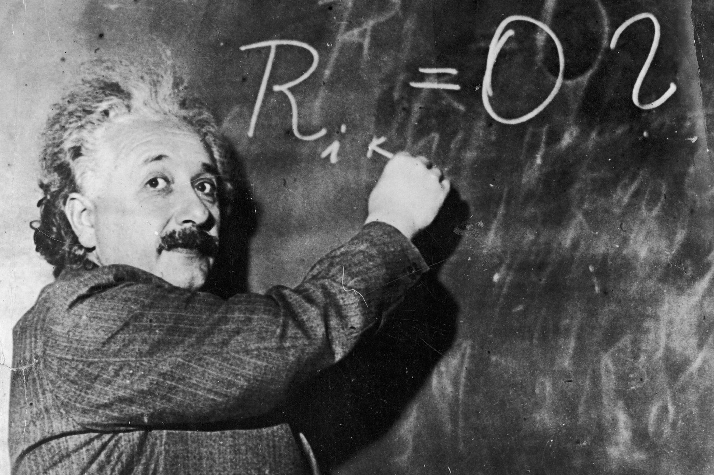

*image source: fredmantel / Getty Images*
## Introduction
 The concept of time travel is certainly a fascinating topic and one that has made its way in folklore as well as in Hollywood. There are many questions concerning time. What exactly is time? Is there an accurate way to measure time and is time travel possible? In this paper, I shall argue that time travel is in fact not possible, neither is it realizable by considering the mathematical possibility of time travel as well as the logical possibility of it. However, I will also suggest that even if time travel were mathematically and physically possible, it is still not realizable. I will also consider the possibility of travelling into the future versus travelling into the past and discuss the famous paradoxes as well as using examples from popular fiction in order to provide varying perspectives.
 ## What is Time?
Firstly in order to have a universal understanding of what constitutes time travel, it is important that I first define what time is, specifically its structure and the assumptions I shall be using in this paper. Time can be classified as physical, biological and psychological(​Rupasinghe, 2017​). Biological time is associated with the internal “clocks” of organisms for example the ageing process is evidence of one’s biological time. Psychological time is more subjective and relates to our perception of how we feel time flies. For example placing your hand on a hot stove for a few seconds can “feel” much longer than spending a few minutes with a loved one. Physical time is the time that is used in physics and is also the time that is measurable. (​Rupasinghe, 2017)​ . Physical time is what I shall be using for the rest of the paper as it is the least subjective and more of a universal standard of what constitutes time. Maudlin characterizes time as one-dimensional. This is a natural characterization if one were to accept Newton’s account of absolute time. There are two major philosophical explanations of time, one is absolute time which was made famous by Newton and the other is relative time which was popularized by Einstein. Whichever theory you subscribe to still defines time as one dimensional. With regards to absolute time, Maudlin states that Absolute time is made up of instants or moments, each of which contains infinitely many events that happen simultaneously. Newton’s premise was that any moment of duration was equal regardless of where the duration occurred. He viewed a single moment of time as all encompassing of space and absolute time is hence the totality of all such moments. Hence defining time as one dimensional in the absolute sense means that these moments(of time) have a one dimensional geometry or as Maudlin explains, a “timeline”. An important characteristic of a one dimensional geometry is that there are only a maximum of two directions at any given point. For example consider a basic cartesian coordinate system, each axis has two possible directions. In the case of the y -axis

 you can have an upwards and downwards direction, in the case of the x-axis you can have a left and right direction and in the case of the z-axis you can have a forwards and backwards direction. This is the same with time and given any moment of Newtonian absolute time, the two directions are either moving toward the future or toward the past. Given the premise of time being one dimensional (at least in the absolute sense) it is perfectly valid to state that time either moves towards the future or past. However, Newton’s explanation of absolute time is dependent on the concept of absolute simultaneity which is that a pair of distinct events can occur at the same time which does not align with the relativistic view of time. Unlike in absolute time, in relativity there is no moment that is diffused throughout space, time is not viewed as a collection over all universal instants. In proving the one dimensionality of time in the relativistic sense, Maudlin redefines the topology of time.
 ### Geometry of Time
 
 
 *image source: https://thespectrumofriemannium.wordpress.com/2012/06/07/log013-spacetime/*

According to Maudlin, time in Relativity can be characterized as locally one-dimensional. For example given the geometry of a Minkowski diagram and an event, although there are an infinite number of ways to move continuously in time from this event, every light-like path through this event can be partitioned into two distinct classes based on the light cone structure of the event. Maudlin then explains that any direction from this event into one of the light cones can be continuously shifted to any other direction or onto that light cone. Given this explanation, it means that the set of time-like and light-like directions from this event can be divided into exactly two classes which constitute the future and past. This interpretation aligns with the one dimensional view of time as at any given moment, any event in space-time can be divided into two classes: the future direction and past direction. One could view this division as a division into past and future light cones. One could argue that the classification of time as one dimensional is subjective with respect to the space-time diagram used and that characterizing time in Relativity as locally one dimensional relies on unproven premises. Maudlin alludes to these possible issues and states “it is an open question which of these depict ways that space-time might be”. However, for the purposes of this paper and argument I shall treat time as having a one dimensional geometry with two directions: future and past. And the space-time geometry I will be using is the Minkowski space-time.
The final step in defining time in this context is defining the measuring unit of time, e.g. how to measure time. A clock is an instrument that measures time. According to Maudlin, An ideal clock is some observable physical device by means of which numbers can be assigned to events on the device’s world-line, such that the ratios of differences in the numbers are proportional to the ratios of Interval lengths of segments of the world-line that have those events as endpoints.
 ### Technical Evidence of Time Travel
This definition is particularly useful in understanding scenarios such as the twin paradox. Maudlin provides an interesting scenario in which there is technical evidence of time travel. In this scenario, consider a Minkowski space time which has been compactified in a time like direction such that the circular cross-sections of the cylinder form closed time-like curves. In this modified topology, one can arrive at the same event after following a continuous trajectory in the forward time direction. This is similar to how standing at point x on the equator, one can travel continuously in one direction (either east or west) along the equator and eventually return back to point x. Now imagine that at time stamp 1:00 (measured using an ideal clock) there’s a clock that drifts inertially to the right and at time stamp 1:01 it collides with another object which causes it to accelerate (based on Newton’s third law of motion). Here’s the trick though, the object this clock collides with is the exact same clock. Assuming I was an observer with the clock, at time stamp 1:01 the collision sends the clock on ahead and by looking backward, in the opposite direction from where the object appeared, I see another clock with an observer approaching from behind (relative to me). At time stamp 1:03, a second collision occurs (with the clock I see behind me) which propels me forward and leaving the colliding clock in place. However throughout this entire scenario there is effectively only one collision in the history of this universe and only one single clock. Yet due to the nature of the space-time described earlier, every event lies in both the future and past light-cone of every other event, including itself. Maudlin continues by stating that if one were to trace out light rays in this universe, it can be easily verified that the observer will always be able to see both past and future versions of themselves. Hence the conclusion is that this particular topology of space-time allows for time travel, where an observer who locally moves forward in time can return to an event they have already experienced. However, it is clear that this scenario is more hypothetical than valid. This topology is an altered version of the classical Minkowski space-time diagram which is closed in the space-like direction and hence is not an accurate representation of our space time. Assuming however that this is a valid physical representation of space time, the scenario still makes a big unproven assumption which is that the clock collides with itself. It is entirely possible for the clock to move inertially in this space time indefinitely without ever colliding with itself. However assuming for argument sake that the clock did collide with itself, it is debatable whether this constitutes “time travel”. The observer can only view past or future versions of themselves but not interact with these versions of themselves. One can argue that just based on the fact that the observer can view a past version of themselves means that the observer travelled back in time. But the question then remains that did the observer physically travel in
time or is the observer just viewing the past from the observer’s present perspective? Even with this modified improbable space time topology it is still not certain whether the observer actually travelled in time or not and as Maudlin writes, “there is no solid physical or empirical reason to think time travel into one’s local past is physically possible.” Certainly if we were dealing with the classical space time diagram which is closed in the space-like direction then this scenario would not be possible thereby eliminating the possibility of time travel as a result of viewing the past or colliding with yourself.
We’ve discussed the mathematical and physical possibility of time travel based on altering our space time topology and even under these altered conditions there is no objective evidence of time travel. These physical scenarios rely on hypothetical models that may or may not be possible. However based on the models and diagrams that we do have and that have been hypothesized about, there is still no evidence of time travel. For the rest of the paper, I shall consider the logical possibilities of time travel.
### Definition of Time Travel
 Now that we have a basis for the definition of time and how to measure time, we can now define time travel. According to David Lewis’ article on “The paradoxes of time travel”, he defines time travel as involving a discrepancy between time and time. Specifically he writes, “Any traveler departs and then arrives at his destination; the time elapsed from departure to arrival is the duration of the journey. But if he is a time traveler, the separation in time between departure and arrival does not equal the duration of his journey. He departs; he travels for an hour, let us say; then he arrives. The time he reaches is not the time one hour after his departure. It is later, if he has travelled toward the future; earlier, if he has traveled toward the past. If he has traveled far toward the past, it is earlier even than his departure”. (qtd. in Lewis 145) (​Rupasinghe, 2017​). This characterization of what constitutes time travel is what many philosophers agree to as the definition of time travel and is what I shall also use. It is important to distinguish between the actual passing of time as measured by an ideal clock and one’s perception of time. For example if I go to bed at ten pm and wake up at 7am then nine hours have elapsed between going to bed and waking up so we can say I slept for nine hours. However from my perspective it seems as if only one hour elapsed between going to bed and waking up, i.e. in deep sleep I did not notice the passage of time and I feel as only one hour has passed. Based on the prior mentioned definition of time travel, this will constitute as time travel if the feeling that only one hour has passed was an acceptable metric for the measurement of a passage of time. Luckily we have already defined what constitutes measuring time using an ideal clock and one’s perception of the passage of
 time is not a valid substitute for the measurement using an ideal clock. Hence such scenarios do not constitute time travel.
 ### Einstein and Relativity
 
 *https://www.wired.co.uk/article/einstein-theory-relativity*

Einstein’s special theory of relativity includes two postulates. The first postulate is that the laws of physics remain the same in every reference frame at constant velocity and the second postulate is that the speed of light is constant at every reference frame.(​Rupasinghe, 2017)​ . In this context, a reference frame is defined as a position in a coordinate system, an example of a coordinate system could be Cartesian coordinates or Lorentz coordinates which is commonly used in the physics of time. Philosophers have used these postulates and the relativistic nature of light to explain the famous twin paradox. Just to give a brief overview, in the twin paradox you have two twins, twin A and twin B. Twin A remains on Earth whilst twin B travels to a distant planet in space. When twin B returns to Earth, it turns out B has aged only x years compared to A who has aged y years., (where x < y). Maudlin explains this in terms of the clock hypothesis. By the time twin B returns to Earth, B’s clock shows a different elapsed time relative to twin A’s clock which means that both clocks have measured different intervals. A remains at a constant velocity on Earth satisfying the first postulate of Einstein’s theory of special relativity but B accelerates to a max speed and decelerates upon arrival at the planet, then B accelerates again to her max speed and changes direction to return back to Earth. Since throughout the journey, B was accelerating and decelerating prior to reaching max velocity, B does not satisfy Einstein’s first postulate and she also travels at an enormous speed causing her clock to appear as if it runs slow. As a result, one can conclude that B travels 4 years into the future (Gott 68), since the time travelled is less than the time passed in A’s reference frame.(​Rupasinghe, 2017​). This is certainly an interesting conclusion, however I don’t believe it fully satisfies the requirement of time travel. Based on Lewis’s definition of what constitutes as time travel, the time elapsed between departure and arrival is the length of the journey. Let’s define the journey as the entire round trip journey i.e. from B departing Earth to B arriving back on Earth. B’s clock measures a journey length of x years whilst A’s clock measures a length of y years (where y is greater than x). From B’s perspective, the separation in time between departure and arrival equals the duration of B’s journey hence there was no time travel; however, from A’s perspective, the separation in time between departure and arrival does not equal the duration of B’s journey. The length of B’s journey is x years but from A’s perspective it is y years hence B has travelled to the future from A’s perspective but from B’s perspective there was no time travel. Lewis’s definition of time travel makes no mention of a reference frame which makes it difficult to determine whether there was any travel through time. I consider this
situation a stalemate. Technically B travelled into the future, using Earth as a reference frame, technically B did not travel into the future using B’s perspective.
## Travelling into the Past
Let us now consider the possibility of travelling into the past. There are two sets of possible options when travelling to the past, one is the set of options corresponding to changing an event in the past and the other is the set of options corresponding to just being an observer in the past, i.e. not changing anything. Travelling to the past is the single greatest source of contention within the debate concerning the possibility of time travel and it’s also filled with the most paradoxes. The paradoxes involve travelling to the past and partaking in an activity that ensures that one cannot possibly have travelled to the past(Maudlin). For example the grandfather’s paradox involves travelling to the past to kill one’s grandfather before he had any children which is an obvious contradiction because the causal explanation for traveller’s existence is the traveller’s grandfather and hence killing him before he has any children means the traveller would never have been born in the first place which is a contradiction. Maudlin argues strongly against the possibility of travelling to the past in order to change an event or “change the past”. In his argument, he asserts that past, like the present and future only happen once and in a particular way. For example one cannot travel to the past and change a set of events e.g. killing one’s grandfather because it implies there were two distinct set of past events, one with the traveller and one without which is an incorrect implication according to Maudlin because there can and was only one set of events.
This is certainly a fair point. Critics however, may argue that this is in fact possible, that there can be multiple sets of “past events” such that changing the past does not lead to a contradiction. This involves having multiple “timelines” and is also the premise of a lot of time travel scenarios in fictional time-travel stories. 
### Avengers

 *Marvel Studios*

The Avengers in “Endgame” were able to travel back in time as long as they kept the multiverse intact by keeping the multiple timelines in their respective universes. As Doctor Banner says, “If you travel to the past, that past becomes your future, and your former present becomes the past which can’t now be changed by your new future”. What he was essentially saying was that you can’t alter the past because you’ve existed in the future, regardless of what you do, the end result will be the same. This almost aligns with Maudlin’s argument in the sense that there is always one set of events for the past, present and future and not multiple sets of events. The writers of Endgame created a scenario in which the Avengers were able to travel back in time using the infinity stones, which creates a perception of time. Removing one of the stones creates new timelines which are darker than the present timeline. Hence Dr Banner in the movie suggested that they have to return each stone back to
 the original timeline it was taken from so that chronologically it never left that timeline in the first place! In summary, the Avengers could not change their own timeline even by going into the past, but removing the infinity stones from an earlier point would change it and hence putting them back in their original timeline at the same time it was taken means it never left in the first place.(Screen Rant) This was definitely an interesting proposition except for the very end when Captain America breaks the time travel rules the writers set in the movie and stays in his past timeline. There sorts of movies and scenarios relies on the theory of the multiverse, which means that everytime you travel back in time you travel to a parallel universe. This multiverse theory is certainly a popular one in science fiction but the reality is that it is just that, just an unproven theory with many flaws. One of them being that if you travel back in time and end up in a parallel universe then if you travel to the future, what guarantee is there that you don’t end up in the same timeline you left in the first place? If you do it means that the changes you made when you travelled back in time were irrelevant because they were not in your current timeline. If however when you travel back to the future and you stay in this new timeline, it means that there was no causal reason to have travelled back in time in the first place.
 ### Travelling to the Past as an Observer
There is however a second set of options when travelling back in time, which involves travelling back in time as an observer and only an observer and not making any changes. The one rule is that you can only observe events that you have already observed, thereby not changing any event. I argue that this set does not exist. Consider travelling back in time to witness a traumatic event such as the murder of a loved one. Then you travel back to the present (before you travelled back in time) and filled with anger you kill the person that you witnessed(when you travelled back in time) kill your loved one. This creates a change in the future light cone which would not have happened had you not gone back in time in the first place. One might argue that just one possible contradiction doesn’t nullify this set of options given that there could be other valid scenarios that don’t result in a contradiction. However, this is not a correct assumption because given one scenario that results in a logical contradiction, the entire set of possibilities is nullified because it means that the contradictory scenario is always a possibility because there is nothing stopping you from partaking in the contradictory scenario.
## Conclusion
Time travel makes for great entertainment in popular fiction and is always a great source of heated and lively debates. This author however, is unconvinced that it is a realizable outcome. Based on the definition of time being one dimensional, we know that time has two possible directions: a future direction and a past direction.It is certainly a theoretical possibility to travel into the future as shown earlier using the twin paradox analogy where one twin travelled to the “future” relative to the other twin that remained on Earth. This is not a realizable outcome because we do not have the capabilities (yet) to construct a device capable of travelling at close to the speed of light for such a long time and also the effects on a human traveller travelling at such high speeds are unknown. Travelling to the past, however, is neither realizable nor possible. The set of events that represents changing an event in the past is logically impossible and the set of events that involves travelling to the past as an observer is not realizable due to possible contradictions. Finally time travel is not possible because if it was, it will have already happened.

 Bibliography 
*Tim Maudlin, Philosophy of Physics - Space and Time,(Princeton: Princeton University Press,
c2012)* 
*Rupasinghe, Ramitha, "The Philosophy and Physics of Time Travel: The Possibility of Time Travel" (2017). Honors Capstone Projects. 1.* 
*Lewis, David. "The Paradoxes Of Time Travel". American Philosophical Quarterly 13.2 (1976): 145-152. Print.* 
*Smith, Nicholas J.J. "Time Travel". Plato.stanford.edu. N.p., 2013. Web. 23 Apr. 2016.* 
*Screen Rant, “Why Avengers: Endgame’s Time Travel Makes Perfect Sense”(2019). YouTube.*
