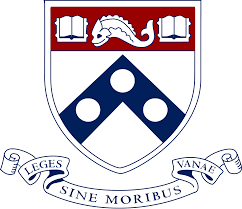

I was fortunate enough to be able to contribute to the development of some of the classes I enjoyed at Penn across multiple departments. Worked as a teaching assistant for 4 courses in the Electrical and Systems Engineering Department and was a PM (Project Manager) for one course in the Computer Science Department.

    

     <h5 id="Titre">Teaching Assistant for ESE350 - Embedded Systems</h5>
                
    

    
        
          <b>Duration: January - May 2020. Philadelphia, PA</b> 
        This course serves as an introduction to interfacing real-world sensors and actuators with embedded microprocessor systems. Concepts needed for building electronic systems for real-time operation and user interaction, such as digital input/outputs, interrupt service routines, serial communications, and analog-to-digital conversion are covered. The course concludes with a final project where student-designed projects are featured in presentations and demonstrations.
         <ul> 
            <li>Assisted Students via in person office hours with lab projects. </li>
            <li>Led the execution of one of the lab projects. </li>
            <li>Graded labs and helped plan the course alongside the Professor.</li>
        </ul> 
        <b>Tools</b> : Atmega328p, microcontrollers, AVR-C, Circuits, timers 
        
    

     

    

     <h5 id="Titre">Project Manager for CIS350 - Software Engineering</h5>
                
    

    
        
          <b>Duration: January - May 2020. Philadelphia, PA</b> 
        This course introduces students to various tools, processes, and techniques that are used by professional software engineers to create high quality software, focusing on software design and software testing. Additionally, students will apply these tools in the creation of a software system including a mobile front-end and a web-based back-end. 
         <ul> 
            <li>Worked as a PM for two teams of four students </li>
            <li>Oversaw the development of a mobile and web app for each team. Focused on the agile development cycle. </li>
        </ul> 
        <b>Stack:</b>Node.js, MongoDB, Android   
        
    

     

    

     <h5 id="Titre">Teaching Assistant for ESE 215(Circuits),  ESE 111(Atoms, Bits, Circuits, and Systems),  ESE 190(Introduction to Open Source Hardware and Software Platforms)</h5>
                
    

    
        
          <b>Duration: January 2017 - December 2018. Philadelphia, PA</b> 
        ESE 215: This course gives an introduction of modern electric and electronic circuits and systems. Designing, building and experimenting with electrical and electronic circuits are challenging and fun. It starts with basic electric circuit analysis techniques of linear circuits. It continues with 1st order and 2nd order circuits in both the time and frequency domains. It discusses the frequency behavior of circuits and the use of transfer functions. 
        Responsibilities included:
         <ul> 
            <li>Weekly Lab sessions and office hours in which I helped students with tasks ranging from debugging circuits to understanding circuit theory to mathematical analyses </li>
            <li>Graded Labs and exams</li>
            <li>Oversaw and mentored students in their final projects</li>
            <li>holding workshops for various skills such as coding soldering, etc.</li>
        </ul>  
        <b>Tools</b> : CircuitLab, Arduino, MOSFETs  
        
    

            

