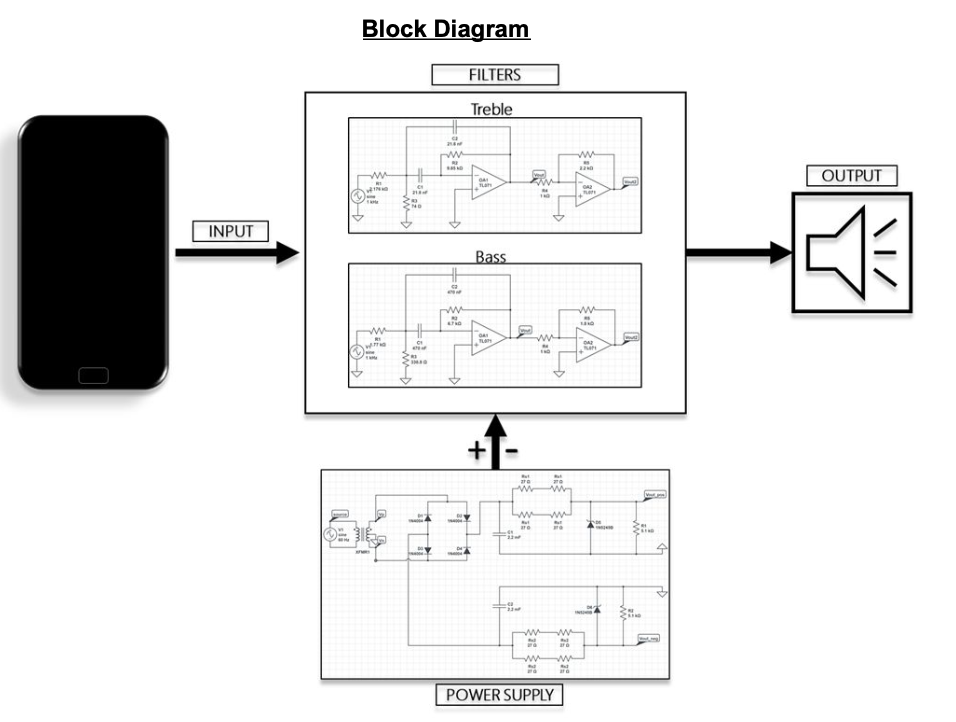
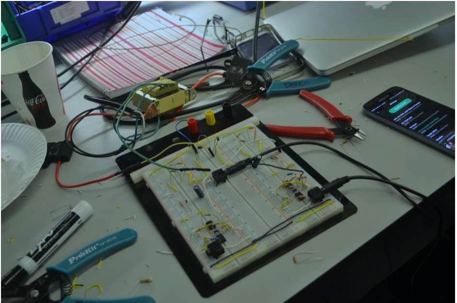
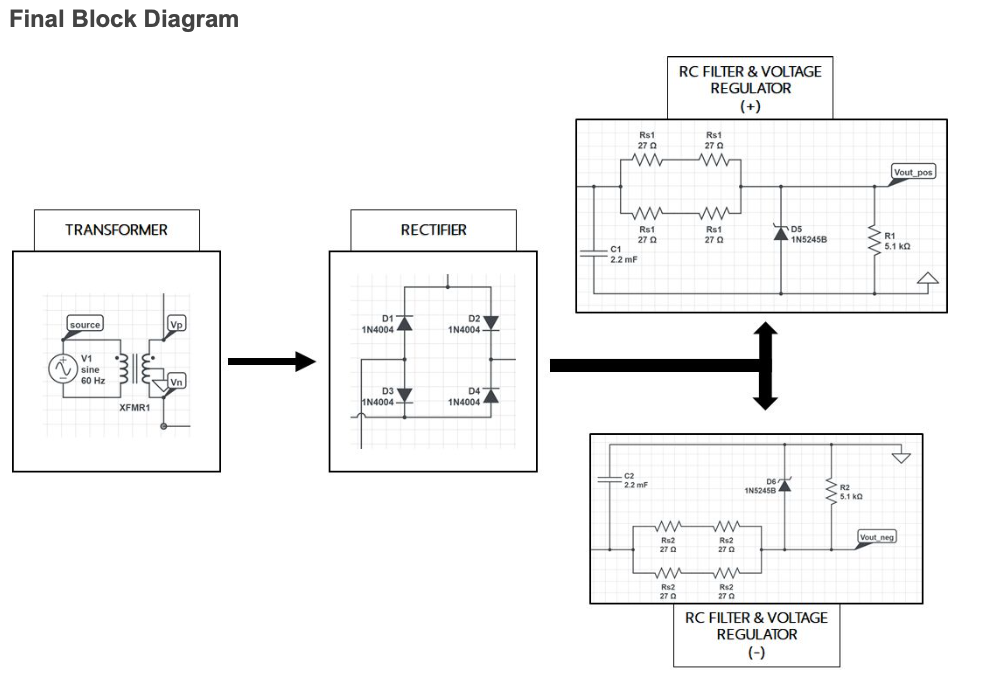

The purpose of this project was to build a bass and treble audio docking station by designing our own bandpass filters as well as a custom power supply.

 

  |  
:-------------------------:      |       :-------------------------:
    University of Pennsylvania    ESE215:Circuits    **Tools**: Circuits, Circuit-Lab,    **Teammate**:[Kyler Mintah](https://www.kylermintah.me)   [Project Report](./report.pdf) | We set out to design two filters to handle an unamplified audio signal of voltage that ranged from 0 to approximately 300 V​ and frequency from 20 Hz to 20 kHz (the RMS​ audible spectrum). Our first filter we designed was to filter the bass frequencies of our input signal, and our second to filter out the treble frequencies of our input signal. Our given filter specifications were as follows:   **Bass Filter**  Frequency Range (Bandpass Specification): 150 Hz to 350 Hz Roll-Off Rate: -20 dB   **Treble Filter**  Frequency Range (Bandpass Specification): 7.9 kHz to 9.9 kHz Roll-Off Rate: -20 dB. This meant that we needed to build a filter with a bandpass that ranged from 150 Hz to 350 Hz for the bass filter and 7.9 kHz to 9.9 kHz for the treble filter.  Read More [here](./report.pdf)

&emsp;&emsp;&emsp;&emsp;&emsp;&emsp;&emsp;&emsp;&emsp;&emsp;&emsp;&emsp;&emsp;&emsp;&emsp;&emsp; &emsp;&emsp;&emsp;&emsp;
<i>Final Block diagram for the power supply</i>

