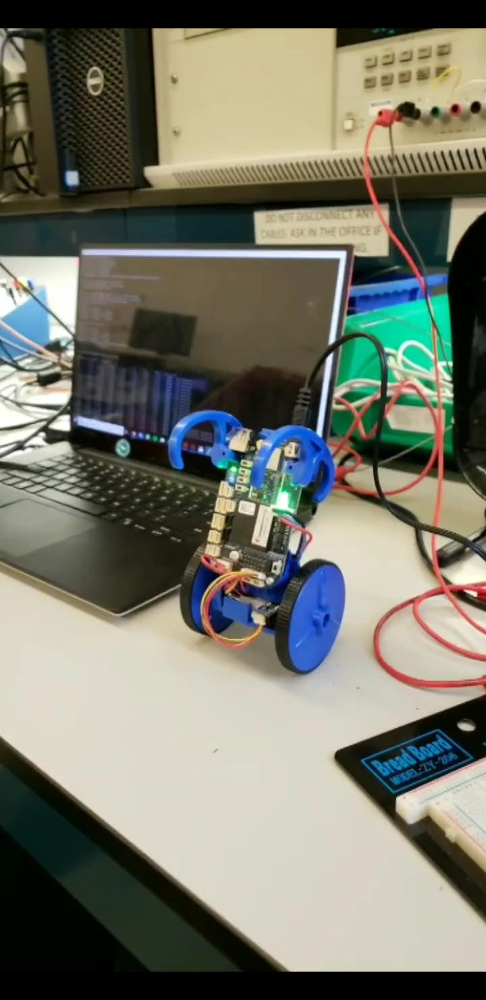

We tricked out our balance bot and programmed race control algorithms and placed top 5 in a class of 20+ teams for fastest track completion time (our time was 27 seconds with the slowest team taking +180 seconds and fastest 10 seconds).

<iframe src="https://player.vimeo.com/video/329244325" width="640" height="538" frameborder="0" allow="autoplay; fullscreen" allowfullscreen></iframe>

 

  |  
:-------------------------:      |       :-------------------------:
    University of Pennsylvania    ESE350:Embedded Systems    **Tools**:  C/C++, PID controls, Beaglebone, mqtt   **Teammate**:[Kyler Mintah](https://www.kylermintah.me)  | PID Control systems are being used in most major transpiration systems today including cars, autonomous vehicles, drones and more. Understanding how PID works, and being able to incorporate it into larger systems will prove to be a catalyst towards effective control in a future characterized by system controls innovations.

