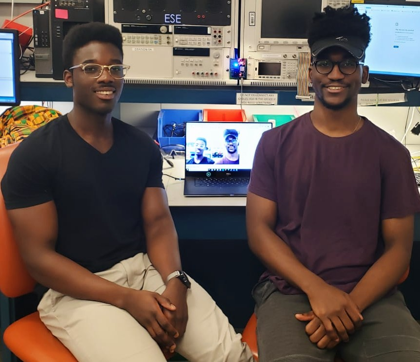

Calorie Life Cam is a miniature camera that serves as a wearable dietary documentation aid for patients with nutritional needs. The device uploads photos it takes to a webserver where the photos are filtered for food.

 

  |  
:-------------------------:      |       :-------------------------:
    University of Pennsylvania    ESE350:Embedded Systems    **Tools**: Python, C/C++, Google Cloud Services, IBM Watson, PCB Design, ESP32, IMU, MQTT Server, Demo Presentation   **Teammate**:[Kyler Mintah](https://www.kylermintah.me)   [Github](https://github.com/masterford/CalorieLifeCam), [Devpost](https://devpost.com/software/calorie-life-cam) | Greater than 90% of U.S. adults daily consume sodium in excess of the 1500 milligrams recommended by the guidelines of the Institute of Medicine (IOM) and multiple other medical associations. This is true despite innumerable scientific and public health documents over decades recommending a restricted dietary sodium intake. The recommendation to limit sodium intake have been made most strongly for populations with established cardiovascular disease including; hypertension, cerebrovascular disease, congestive heart failure, aortic aneurysm and chronic kidney disease. The Calorie LifeCam captures images continuously every 30 seconds and compares the images using IBM Watson's visual recognition tool to categorize food images. It can also distinguish between food and non-food. It then pushes the images to a Google Cloud storage bucket. We setup the Google Cloud IoT core as a way to store images on the cloud and we are also able to push telemetry data to the cloud. The user can view these images via a local MQTT server that we created and view the images on a continuous loop. Our LifeCam is also adept at power management. It utilizes a Razor IMU unit to determine the orientation of the camera and if the camera has been lying flat for a sufficient amount of time (2 min) we enter Deep Sleep mode which activates the ESP32's Ultra Low Power (ULP) coprocessor mode which deactivates every internal system except for the RTC (real time clock) which requires only a 6 uA draw to maintain functionality. We come out of ULP mode to sample the IMU every 30 seconds to determine whether the orientation has changed (so that we can permanently exit deep sleep mode). We sample the IMU using UART communication protocol.   Read More [here](https://github.com/masterford/CalorieLifeCam/blob/master/README.md)  Video Demo [Here](https://devpost.com/software/calorie-life-cam) 

&emsp;&emsp;&emsp;&emsp;&emsp;&emsp;&emsp;&emsp;&emsp;&emsp;&emsp;&emsp;&emsp;&emsp;&emsp;&emsp; &emsp;&emsp;&emsp;&emsp;
<i>Demo Day</i>

