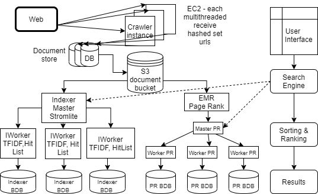
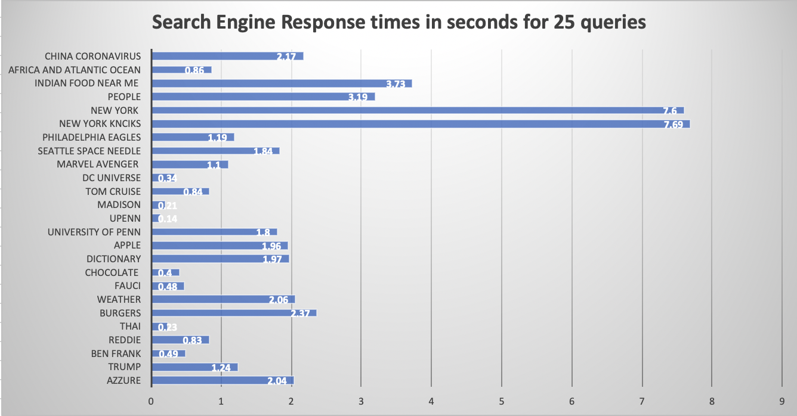
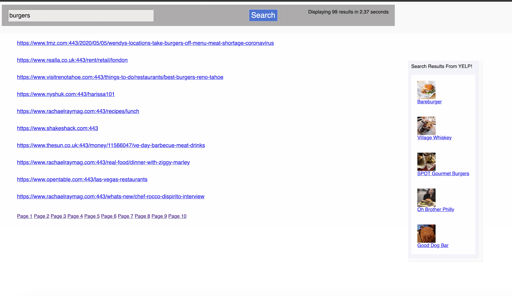

We designed and implemented a distributed search engine adopting [Mercator](./mercator.pdf) style crawler to implement efficient crawling, used Stormlite framework for indexing, Apache Hadoop framework for PageRank and a clean, quick and high quality user interface for the search engine along with some interesting extra features.

 
 

  |  
:-------------------------:      |       :-------------------------:
    University of Pennsylvania    CIS555:Internet and Web systems    **Tools**: AWS, Java, BerkeleyDB, Spark Java, Amazon S3, Amazon EC2, Apache Storm, Apache Hadoop      **Teammates**: [Shashank Prasad](https://github.com/shashank2408), [Shruti Sinha](https://github.com/shruti0085/), [Garvit Khandelwal](https://github.com/garvitkh)     [Project Report](./report.pdf) | GRS2 is a distributed and scalable search engine built of a streaming framework called stormlite, which is a lightweight version of Apache Storm. We implemented an in-memory cache to keep track of commpon queries submitted by users which improved the search performance significantly. Integrated with additional APIs such as Yelp and Weather to improve the search experience.   I was responsible for the web crawler which included: <ul><li>Master, worker architecture as found in Mercator</li><li>Dynamic addition of worker Nodes</li><li>Incremental Crawling (crawler resumes from previous state)</li><li>Crawled over 1.7 million URLS</li></ul> 

&emsp;&emsp;&emsp;&emsp;&emsp;&emsp;&emsp;&emsp;&emsp;&emsp;&emsp;&emsp;&emsp;&emsp;&emsp;&emsp; &emsp;&emsp;&emsp;&emsp;
<i>Screenshot of UI</i>

