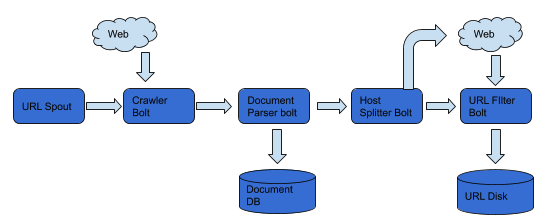
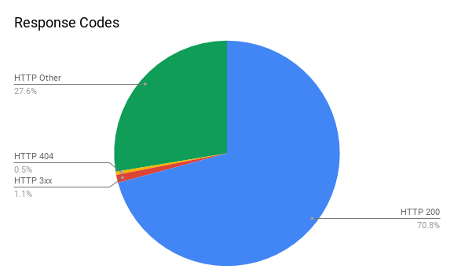
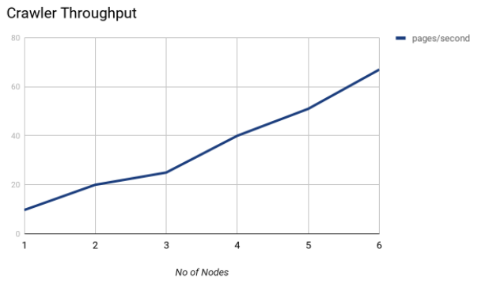

I built a distributed web crawler which was deployed on 7 AWS EC2 instances and crawled over a million URLS.

 
 

  |  
:-------------------------:      |       :-------------------------:
    University of Pennsylvania    CIS555:Internet and Web systems    **Tools**: AWS, Java, BerkeleyDB, Spark Java, Amazon S3, Amazon EC2, Apache Storm    [Github](https://github.com/masterford/DistributedWebCrawler) | The design of the crawler borrows heavily from the [Mercator](./mercator.pdf) design. The crawler was designed for maximum efficiency in terms of throughput, whilst also respecting crawl delays and other admin specified behaviour within the robots.txt of websites. Building a distributed crawler comes with certain challenges that are not present on a single node crawler. To make the crawler as robust as possible, I periodically save the majority of the crawler state on disk so that in the event that it does crash, it can easily resume from where it left off. This feature helped save a lot of time. The URLFrontier was designed to be as polite as possible without sacrificing throughput. I implemented a priority based frontier with 3 different priority levels. The higher the priority of a host name, the more consecutive URLS from that host name can be crawled. The URLFrontier buffers at most a 1000 URLS in memory and the rest are stored on disk. The crawler was built using the StormLite framework which is a miniature version of Apache Storm for stream processing. The architecture for a single worker node is shown above. BerkeleyDB was used to handle the database transactions.  Features included: <ul><li>Master, worker architecture as found in Mercator</li><li>Dynamic addition of worker Nodes</li><li>Incremental Crawling (crawler resumes from previous state)</li><li>Crawled over 1.7 million URLS</li></ul> 

&emsp;&emsp;&emsp;&emsp;&emsp;&emsp;&emsp;&emsp;&emsp;&emsp;&emsp;&emsp;&emsp;&emsp;&emsp;&emsp; &emsp;&emsp;&emsp;&emsp;
<i>Screenshot of Throughput</i>

