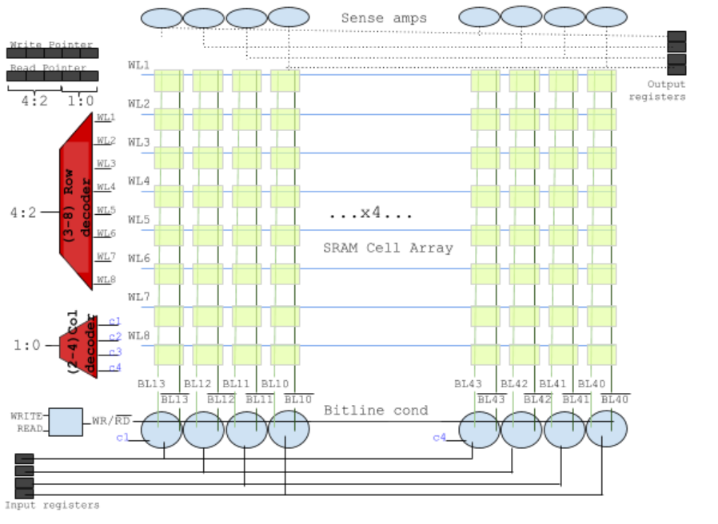
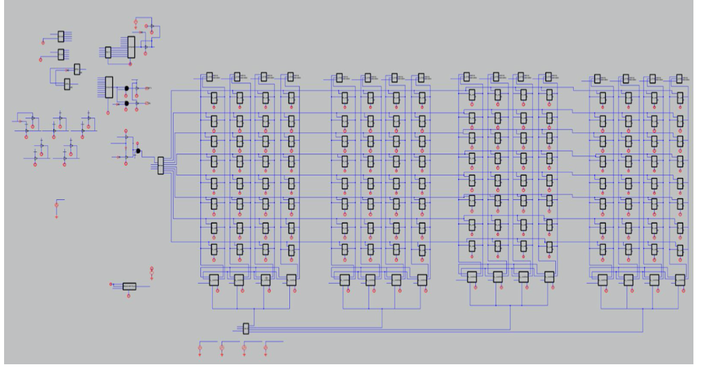

The purpose of this project was to build a memory queue of 32 4-bit words using SRAM memory cells, multiplexers/decoders, registers, sense amplifiers, bit conditioning circuitry and clock generation.

 

  |  
:-------------------------:      |       :-------------------------:
    University of Pennsylvania    ESE370:Circuit-Level Modelling, Design and Optimization for Digital Systems    **Tools**: LTSpice,    **Teammate**:[Celine Lee](https://celine-lee.github.io/)   [Project Report](./FIFO_Memory.pdf) | This project was an open ended design problem where we had to design a synchronous FIFO that can both enqueue and dequeue an item on each cycle. Our target technology was the High Performance 22nm process.   Read More [here](./FIFO_Memory.pdf)  

&emsp;&emsp;&emsp;&emsp;&emsp;&emsp;&emsp;&emsp;&emsp;&emsp;&emsp;&emsp;&emsp;&emsp;&emsp;&emsp; &emsp;&emsp;&emsp;&emsp;
<i>Final Schematic</i>

