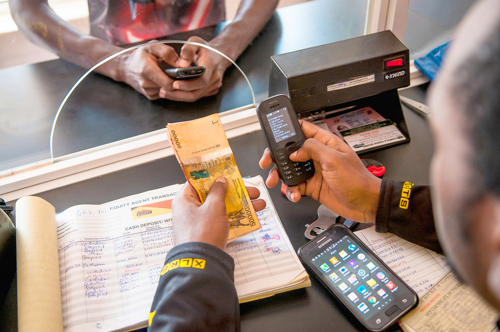
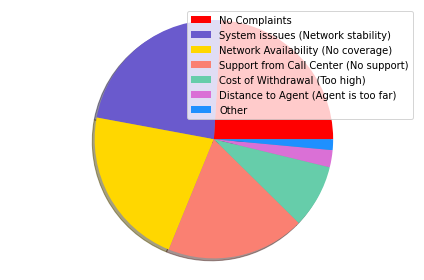

The purpose of this project is to analyze financial services within Sub-Saharan Africa and the state of the rising popularity of mobile money.

[source: https://www.dispatch.ug/the-road-towards-financial-inclusion-in-africa/] 
 

  |  
:-------------------------:      |       :-------------------------:
    University of Pennsylvania    CIS545:Big Data Analytics    **Tools**: AWS, Python, SQL, Skitlearn, machine learning, Data Wrangling    [Github](https://github.com/masterford/ExploratoryDataAnalysis) Read medium post [here](https://medium.com/@masterford/exploring-the-state-of-financial-inclusion-in-east-africa-775521055aed) | There have been lots of discussion revolving around digital payments in Africa and rightly so. In a recent interview on the Lex Fridman podcast, Jack Dorsey CEO of Twitter stated that "Payments is probably the number one problem to solve across the continent" when talking about a conversation he had with an Ethiopian Entrepreneur. Africa as a continent has some of the most successful mobile-phone-based financial service, with Kenya's M-Pesa platform leading the way. Yet despite the proliferation of mobile money there are still a vast number of people that remain unbanked. This project aims to explore the state of financial services within East Africa, specifically Tanzania and Kenya.  Features included: <ul><li>Data Wrangling</li><li>Building a binary classifier using stochastic gradient descent</li><li>Advanced SQL queries

