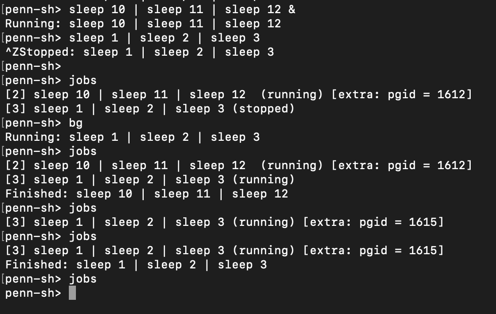
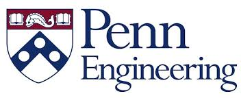

Using the ucontext library, we implemented a basic priority scheduler; additionally, we also implemented a flat file system for our operating system to mount, and a basic shell and programming API for a user to interact with the operating system.

 

  |  
:-------------------------:      |       :-------------------------:
    University of Pennsylvania    CIS380:Operating Systems   **Tools**: C, Unix, File Systems  **Teammates**: [Matteo Sciolla](https://it.linkedin.com/in/matteo-sciolla-368b68130), [Sheil Sarda](https://www.linkedin.com/in/sheilsarda), [Adam Kirsh](https://www.linkedin.com/in/adam-kirsh-0b9ab67b)    | The goal of this project was to build a UNIX like Operating System from scratch. I worked on the file system and the user shell as per the specifications "Your operating system will mount a single file system, FlatFAT: a simple file system implementation based on FAT. Your FlatFAT implementation will be stored within a single file on the host file system, and will be mounted by PennOS in a loopback like manner. Additionally, unlike traditional file systems, FlatFAT is only required to handle files within a single top level directory. You are required to allow the creation, modification, and removal of files under the top level directory. The last part of your operating system is providing user land interaction via a simple shell. You will program this shell using the user land system calls providing by PennOS. Your shell will provide job control, stdin/stdout redirection, and a functional set of built-in commands for testing and exploring your operating system."    Report and code not public per University Policy.

