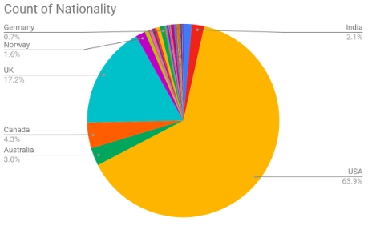
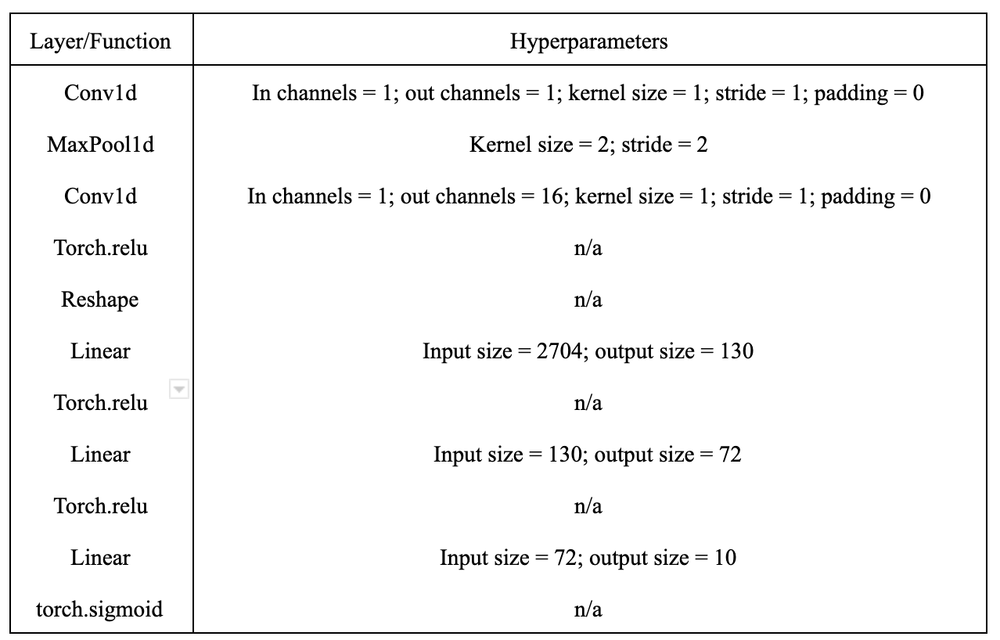

Our team sought to determine the best method to profile specific characteristics of a speaker, given an audio sample. We pre-processed the data to create an even distribution across labels, normalized, and computed fourier transformations as well as F0 fundamental frequency. We then tested different models to determine the most effective classifier.

 

  |  
:-------------------------:      |       :-------------------------:
    University of Pennsylvania    CIS519:Applied Machine Learning    **Tools**: PyTorch, Python, Fourier Transform, Skitlearn, neural networks, support vector machine   **Teammates**: [Celine Lee](https://celine-lee.github.io/), [Chris Foley](https://www.linkedin.com/in/christopher-foley-396a90123), [Divya Bade](https://www.linkedin.com/in/divya-bade)   [Github](https://github.com/masterford/SpeakerProfiling),  [Report](./CIS_519_Final_Report.pdf) | The goal of our project was to determine the best method to profile specific characteristics of a speaker given an audio sample. We focused on classifying the gender and nationality of the speaker. Previous studies in the area of speaker identification and profiling have focused on the use of artificial neural networks or support vector machines independently for classification of either gender or nationality. We used an experimental method to determine if a semi-supervised approach wherein training on nationality and gender together would result in better accuracy than training independently. Ultimately, we found that training independently on nationality and gender with SVMs performed the best. Our NN architecture is shown in the table below 

