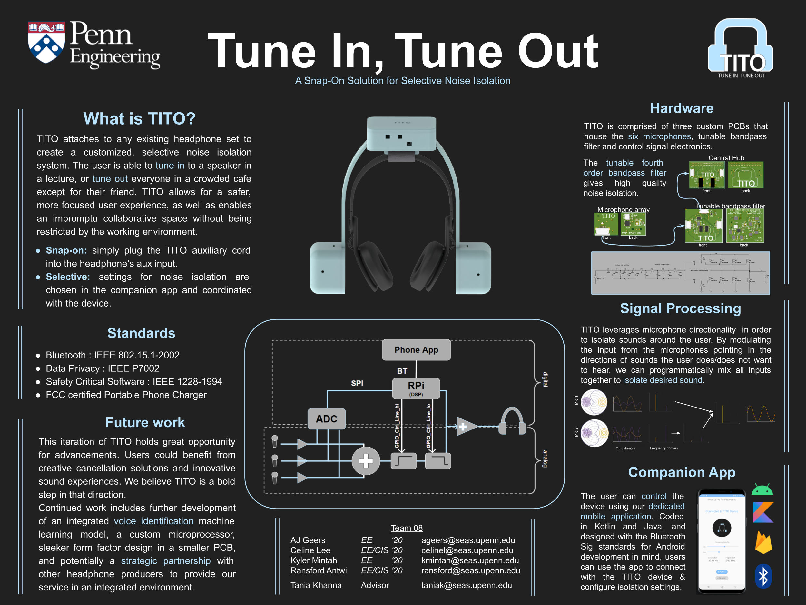
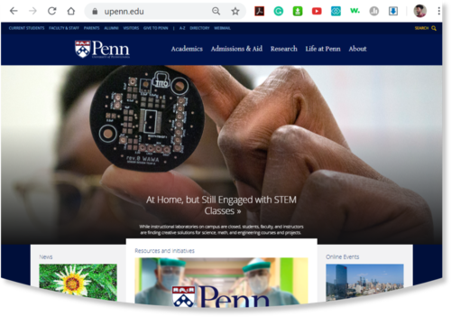

TITO is a snap-on solution for selective noise isolation for existing headsets. The project comprised our final thesis project and represented a culmination of the engineering design skills we had gained over the course of our undergraduate careers.

 
 

  |  
:-------------------------:      |       :-------------------------:
   University of Pennsylvania    ESE450/451:Senior Design    **Tools**: Raspberry Pi, Python, Kotlin, Altium, Android, Java, Bluetooth, CAD      **Teammates**: [Kyler Mintah](https://www.kylermintah.me), [Celine Lee](https://celine-lee.github.io), [AJ Geers](https://aj-geers.github.io)     [Devpost](https://devpost.com/software/tune-in-tune-out) |   Our goal is to create a snap-on solution to selective noise isolation. TITO is a device that can attach to any existing headphone set via the auxiliary port, and create a customized noise environment for the user. The selectivity comes in the form of different settings, controlled through a companion app. The user will be able to choose to tune into a lecturer speaking, tune out everyone in a crowded cafe except their friend, or any other configuration offered in our user-friendly mobile interface. This allows for a focused audio experience for the user, from busy students to safety-cautious field engineers to observant ornithologists.   By expanding on the fields of active noise cancelling headphones and personal assistant voice recognition we utilize directional microphones to create a microphone array system with the capability to isolate sounds around the user. Our mixed-signal approach uses an analog filter to efficiently cut off frequencies outside of the desired range, and a digital signal processing component to further extract sound events within the same frequency band. We then identify the regions of isolation and allow the user to select which sounds to pass through the headphones. Each ear will have it's own microphone board and array, thereby allowing the user maximum flexibility with regards to choosing which direction to focus their attention on.     My contributions were mainly focused on the embedded systems side, i.e. both hardware and software : <ul><li>On the software side, I worked with the server side bluetooth stack</li><li>Streamlined SPI communication between the raspberry pi and filters</li><li>Digital Signal Path to send parse commands from the phone app and stream audio packets to the headset</li></ul> <h3>Award Winning</h3> 
<figure>
	<blockquote>
		
TITO was honored to have won the Fred Ketter Memorial Award which is awarded to the senior design team in the Department of Electrical and Systems Engineering who demonstrates outstanding creativity in an engineering design incorporating hardware

	</blockquote>
</figure>

&emsp;&emsp;&emsp;&emsp;&emsp;&emsp;&emsp;&emsp;&emsp;&emsp;&emsp;&emsp;&emsp;&emsp;&emsp;&emsp; &emsp;&emsp;&emsp;&emsp;
<i>PCB featured on the homepage of the University of Pennsylvania (5-12-2020)</i>

